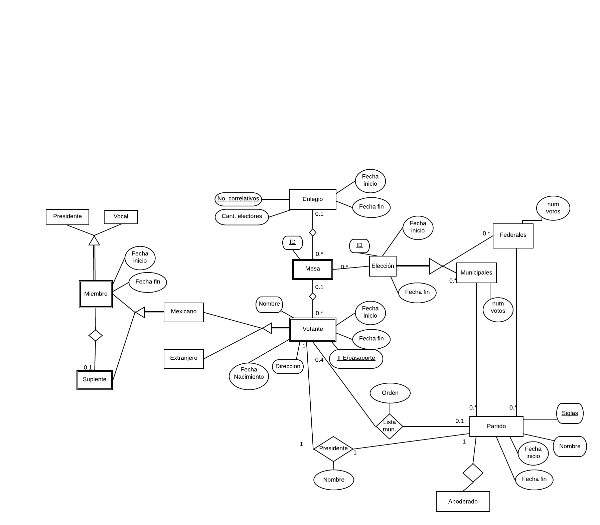
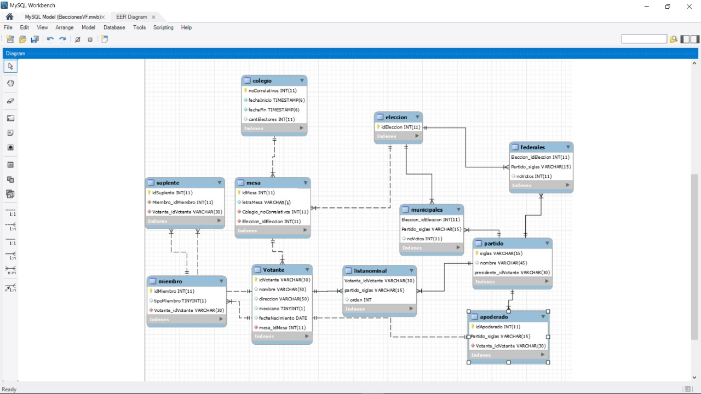

# Tarea 1. SQL Avanzado

---

##### Integrantes:
1. *Camila Rovirosa Ochoa* - *A01024192* - *CSF*
2. *Luis Daniel Roa Gonzales* - *A01021960* - *CSF*
3. *Albert Hassey Padierna* - *A01024639* - *CSF*

---
## 1. Aspectos generales

Las orientaciones de la tarea se encuentran disponibles en la plataforma **Canvas**.

Este documento es una guía sobre qué información debe entregar como parte de la tarea, qué requerimientos técnicos debe cumplir y la estructura que debe seguir para organizar su entrega.


### 1.1 Requerimientos técnicos

A continuación se mencionan los requerimientos técnicos mínimos de la tarea, favor de tenerlos presente para que cumpla con todos.

* El equipo tiene la libertad de elegir las tecnologías de desarrollo a utilizar en la tarea, sin embargo, debe tener presente que la solución final se deberá ejecutar en una plataforma en la nube. Puede ser  [Google Cloud Platform](https://cloud.google.com/?hl=es), [Azure](https://azure.microsoft.com/en-us/), AWS [AWS](https://aws.amazon.com/es/free/) u otra.
* El equipo tiene la libertad de utilizar el DBMS de su preferencia.
* La arquitectura de la solución deberá estar separada claramente por capas (*frontend*, *backend*, datos y almacenamiento).
* Todo el código, *scripts* y la documentación de la tarea debe alojarse en este repositorio de GitHub, siguiendo la estructura que aparece a continuación.

### 1.2 Estructura del repositorio

El proyecto debe seguir la siguiente estructura de carpetas:
```
- / 			        # Raíz de toda la tarea
    - README.md			# Archivo con la información general de la tarea (este archivo)
    - frontend			# Carpeta con la solución del frontend (Web app)
    - backend			# Carpeta con la solución del backend en caso de ser necesario (CMS o API)
    - scripts		        # Carpeta con los scripts necesarios para generar la base de datos, cargar datos y ejecutar las consultas
    - database			# Carpeta con el diagrama Entidad-Relación Extendido y los archivos CSV de datos necesarios para generar la bases de datos

```

### 1.3 Documentación de la tarea

Como parte de la entrega de la tarea, se debe incluir la siguiente información:

* Diagrama del *Modelo Entidad-Relación Extendido*.
* *Scripts* para generar la base de datos, cargar datos y ejecutar consultas.
* Archivos CSV con los datos a cargar en al base de datos.
* Guía de configuración, instalación y despliegue de la aplicación en la plataforma en la nube  seleccionada.
* El código debe estar documentado siguiendo los estándares definidos para el lenguaje de programación seleccionado.

## 2. Solución

A continuación aparecen descritos los diferentes elementos que forman parte de la solución de la tarea.

### 2.1 Modelo de la *base de datos* 

Decidimos hacer nuestro diagrama con el colegio al inicio de la jerarquia por que este va a definir como se organizan todas las otras relaciones de esta forma nos aseguramos que cada colegio tenga organizados las elecciones.
Elecciones solo guarda un id y el periodo mientras que los tipos de eleccion "municipal" o "federal" tienen su propia tabla.
Cada partido guarda la siglas (la llave primaria), su nombre el periodo (fecha de inicio y fin) y un apoderado como relacion ya que estos no estan dentro de la lista de votantes como lo estan el presidente y los que pertenencen a la lista nominal que tiene la restriccion para que solo sean 4. En cuento a los votantes se les tiene un id que es INE/pasaporte (que es la llave primaria), el nombre, fecha de nacimiento, la direccion y el periodo de la eleccion en la que vota. Cada votanten tiene un relacion con la tabla de mesa ya que cada votante tiene una mesa asignada. De igual manera, cada votante puede ser miembro de una mesa siempre y cuando se mexicano, como miembro puede ser presidente, vocal o suplente. Solo puede haber un presidente por mesa y no se pueden repetir personas aunque cambie el colegio. 

### 2.2 Arquitectura de la solución


### 2.3 Frontend
Usamos PHP y se vinculo con comandos de HTML. Con comandos CRUD para modificar la base de datos.
Para mas informacion: https://www.ecodeup.com/crud-en-php-para-principiantes/

#### 2.3.1 Lenguaje de programación
 PHP y comandos de HTML para realizar la operaciones CRUD
#### 2.3.2 Framework
  No se implemento en ningun fremawork 
#### 2.3.3 Librerías de funciones o dependencias
Los datos fueron optenidos en https://www.generatedata.com/

### 2.4 Backend
Utilizamos MySql para crear la base de datos 

#### 2.4.1 Lenguaje de programación
Se uso sql
#### 2.4.2 Framework
MySql Workbench y como se trabajo en Windows se uso los servicios de WampServer
#### 2.4.3 Librerías de funciones o dependencias
PHP myAdmin para comprobar los datos 

## 2.5 Pasos a seguir para utilizar la aplicación

*[Incluya aquí una guía paso a paso para poder utilizar la aplicación, desde la clonación del repositorio hasta el despliegue de la solución en una plataforma en la nube.]*

## 3. Referencias
    https://www.generatedata.com/
    https://www.ecodeup.com/crud-en-php-para-principiantes/
*[Incluya aquí las referencias a sitios de interés, datasets y cualquier otra información que haya utilizado para realizar la tarea y que le puedan ser de utilidad a otras personas que quieran usarlo como referencia]*
